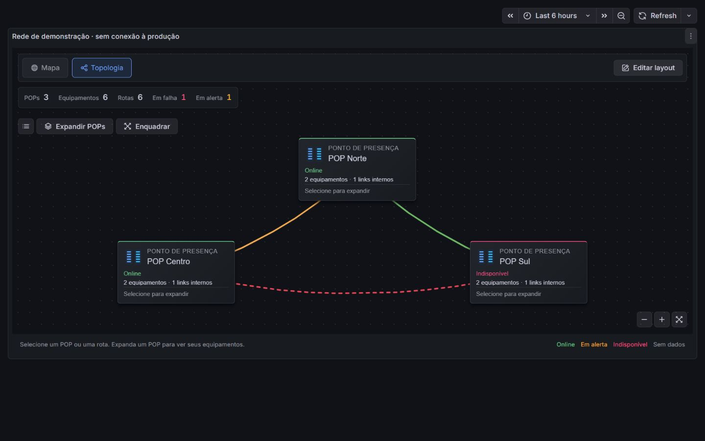
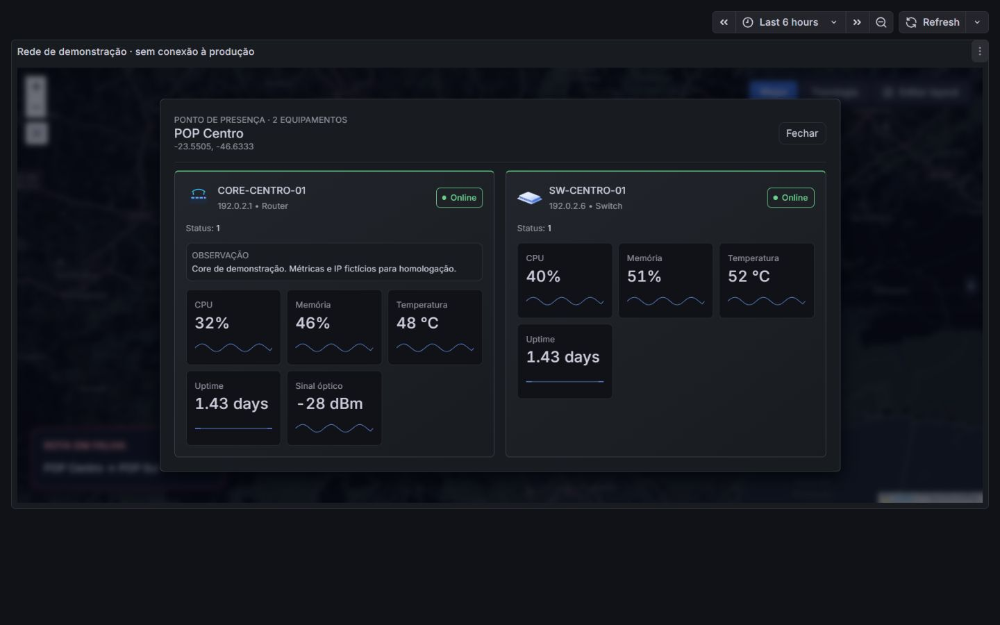

# JMAP (Grafana Panel)

Plugin de mapa para monitoramento de POPs e rotas de transporte em Grafana.

## Versão de teste 1.2.0 — mapa e topologia por POP

A visualização original continua disponível, com aparência refinada dentro do mapa. A alternativa **Topologia** permite posicionar equipamentos, puxar ligações e ajustar caminhos em modo de edição, com desfazer, refazer e cancelar. Após **Aplicar alterações**, salve o dashboard no Grafana.

Os POPs começam recolhidos para priorizar as rotas externas. Selecione um POP e use **Expandir equipamentos** ou **Expandir POPs** para acessar as conexões internas. O inventário mantém todos os equipamentos e rotas, inclusive os recolhidos. Em edição, todos os equipamentos aparecem; **Organizar grupos** reorganiza apenas posições da topologia em rascunho.

Em **Visualização**, escolha rótulos inteligentes, somente nome, detalhados ou ao passar o mouse; contraste suave ou original; e linhas curvas, diretas ou ortogonais na topologia. Desvios manuais e caminhos geográficos são preservados. Ícones, status, tráfego, limites, gráficos, métricas personalizadas, observações, interfaces e trunks continuam disponíveis.

Use a branch `codex/mapa-topologia` em homologação. O original está preservado em `backup/original-2026-10-07` (commit `743a103`). O diretório `dist` inclui o plugin compilado e seus ícones.

Veja o [passo a passo para testar, instalar e reverter](docs/TESTAR-E-REVERTER.md), incluindo um Grafana separado via `compose.homolog.yaml` e um dashboard com dados demonstrativos.

[Baixar o ZIP compilado 1.3.0 para homologação](https://github.com/jakson93/jakson-jmap-panel/releases/download/homolog-1.3.0-20261008/jakson-jmap-panel-1.3.0.zip).

A versão 1.3 remodela o card de falha e acrescenta análise de incidentes, atualização dos dados, dependências explícitas, filtros/visões salvas, histórico observado, alinhamento, posições bloqueadas e portas. Todas as métricas anteriores continuam disponíveis. Não há integração de notificações. O dashboard demonstrativo usa um período histórico fixo e dados sintéticos.






## Instalar no Grafana (Linux)

Este é um plugin **não assinado**, então o Grafana precisa permitir plugins não assinados.

### 1) Baixar o plugin diretamente do GitHub (forma mais fácil)

No servidor do Grafana:

```bash
cd /var/lib/grafana/plugins
git clone https://github.com/jakson93/jakson-jmap-panel.git
```

### 2) Permitir plugin não assinado

Edite o arquivo `grafana.ini` (ou `custom.ini`), e adicione:

```
[plugins]
allow_loading_unsigned_plugins = jakson-jmap-panel
```

Em servidores Linux, o caminho comum é:

```
/etc/grafana/grafana.ini
```

### 3) Reiniciar o Grafana

```bash
sudo systemctl restart grafana-server
```

### 4) Verificar no Grafana

No Grafana:
**Configuration → Plugins** e procure por **JMAP**.

---

## Atualizar o plugin

```bash
cd /var/lib/grafana/plugins/jakson-jmap-panel
git pull
sudo systemctl restart grafana-server
```

---

## Observações

- O repositório é **privado**; o servidor precisa ter acesso ao GitHub.
- Se usar HTTPS e for privado, será necessário autenticar ao clonar/puxar.
- Alternativa: usar SSH com chave configurada no servidor.

---

## Autor

Jakson Soares (jakson93)
