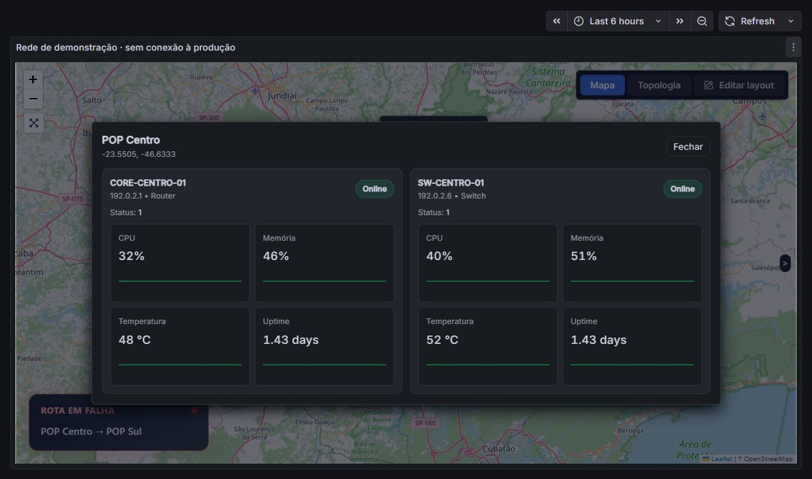

# JMAP (Grafana Panel)

Plugin de mapa para monitoramento de POPs e rotas de transporte em Grafana.

## Versão de teste 1.1.0 — mapa original e topologia

A visualização original continua disponível, com aparência refinada dentro do mapa. A alternativa **Topologia** permite posicionar equipamentos, puxar ligações e ajustar caminhos em modo de edição, com desfazer, refazer e cancelar. Após **Aplicar alterações**, salve o dashboard no Grafana.

Use a branch `codex/mapa-topologia` em homologação. O original está preservado em `backup/original-2026-10-07` (commit `743a103`). O diretório `dist` inclui o plugin compilado e seus ícones.

Veja o [passo a passo para testar, instalar e reverter](docs/TESTAR-E-REVERTER.md), incluindo um Grafana separado via `compose.homolog.yaml` e um dashboard com dados demonstrativos.



## Instalar no Grafana (Linux)

Este é um plugin **não assinado**, então o Grafana precisa permitir plugins não assinados.

### 1) Baixar o plugin diretamente do GitHub (forma mais fácil)

No servidor do Grafana:

```bash
cd /var/lib/grafana/plugins
git clone https://github.com/jakson93/jakson-jmap-panel.git
```

### 2) Permitir plugin não assinado

Edite o arquivo `grafana.ini` (ou `custom.ini`), e adicione:

```
[plugins]
allow_loading_unsigned_plugins = jakson-jmap-panel
```

Em servidores Linux, o caminho comum é:

```
/etc/grafana/grafana.ini
```

### 3) Reiniciar o Grafana

```bash
sudo systemctl restart grafana-server
```

### 4) Verificar no Grafana

No Grafana:
**Configuration → Plugins** e procure por **JMAP**.

---

## Atualizar o plugin

```bash
cd /var/lib/grafana/plugins/jakson-jmap-panel
git pull
sudo systemctl restart grafana-server
```

---

## Observações

- O repositório é **privado**; o servidor precisa ter acesso ao GitHub.
- Se usar HTTPS e for privado, será necessário autenticar ao clonar/puxar.
- Alternativa: usar SSH com chave configurada no servidor.

---

## Autor

Jakson Soares (jakson93)
